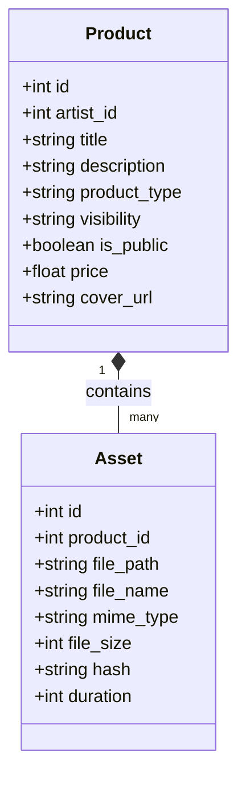
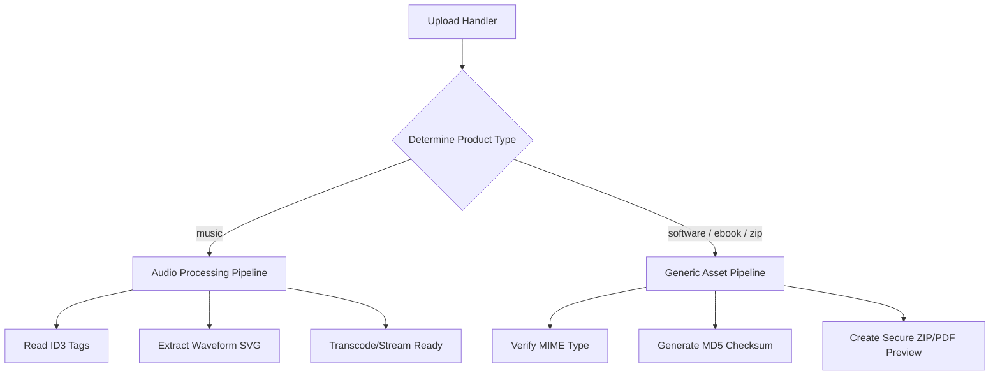
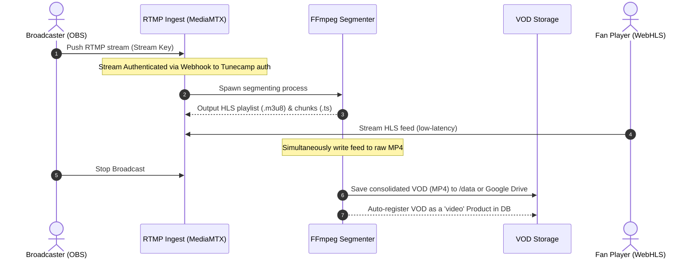

# Architectural Roadmap: TuneCamp Multi-Asset & Streaming Evolution

This document outlines the high-level technical strategy, architectural modifications, and database designs required to expand `tunecamp` from a decentralized music platform into a multi-asset creator marketplace (Gumroad + Twitch + WriteFreely) with ActivityPub federation.

---

## 1. Feature Phase 1: Multi-Asset Sales (Gumroad Style)

To support selling ebooks, digital graphics, software packages, and generic archives, we must abstract the current music-specific database models and processing engines.

### A. Database Refactoring & Abstraction

We will transition the codebase from audio-only models (`albums` and `tracks`) to generic product and asset entities.



#### SQL Migration Strategy
We will add `product_type` to `albums` and adapt `tracks` to handle arbitrary file attributes:
```sql
-- Alter albums to support product classification
ALTER TABLE albums ADD COLUMN product_type TEXT DEFAULT 'music'; -- 'music', 'software', 'ebook', 'graphics', 'generic'
ALTER TABLE albums ADD COLUMN price REAL DEFAULT 0.0;

-- Alter tracks to act as generic assets
ALTER TABLE tracks ADD COLUMN mime_type TEXT DEFAULT 'audio/mpeg';
ALTER TABLE tracks ADD COLUMN file_size INTEGER DEFAULT 0;
ALTER TABLE tracks ADD COLUMN file_hash TEXT;
ALTER TABLE tracks ADD COLUMN version TEXT;
```

### B. Upload & Asset Processing Pipeline

Currently, all file uploads pass through an audio-specific parser (`music-metadata` and `fluent-ffmpeg`). We must implement a format-agnostic router.



- **Generic Asset Pipeline**: Bypasses FFmpeg. Generates file previews based on format (e.g., first 3 pages for a PDF, image resizing/watermarking for graphics, simple metadata file extraction for software packages).
- **Integrated Payment & Access Control Flow**:
  We will fully preserve and generalize the existing dual payment pathways for all new asset types:
  
  1. **Stripe Credit Card Payments**:
     - Retains `/stripe/create-session` but abstracts `type` metadata to support generic values (e.g. `'ebook'`, `'software'`, `'graphics'`).
     - Webhook (`/stripe/webhook`) will capture `itemId` (acting as generic `productId`) and register the generated secure `unlock_code` in the database.
  
  2. **Base L2 Web3 Crypto Payments (ETH & USDC)**:
     - Leverages the existing Base RPC integration.
     - Supports **Direct ETH/USDC Transfers** to the artist's configured wallet, automatically checking split fees (sending `adminFeePercentage` to the `adminTreasuryAddress`).
     - Supports **Checkout Smart Contracts** (`purchaseWithETH` / `purchaseWithUSDC`). We will adapt the front-end to pass generic `productId`s to the smart contract checkout.
     - **Replay Protection**: The transaction verification system (`/api/payments/verify`) validates the on-chain tx receipt on Base and ensures a transaction hash cannot be reused to unlock multiple items.
  
  3. **Universal Asset Unlock & Secure Download**:
     - The general download controller `/api/payments/download/:productId` (adapted from `:trackId`) validates the purchased `unlock_code` or verified `txHash`.
     - Once validated, it streams the asset binary (e.g. ZIP, PDF) from its secure storage location directly to the client with `application/octet-stream` headers, keeping raw file paths completely hidden.

### C. ActivityPub Generalization

Instead of emitting strictly `Audio` or `MusicAlbum` objects, the Fedify outbox dispatcher will generate standard ActivityStreams objects:
- **Ebooks / Documents**: Fedify `Document` or `Article` objects with attachments.
- **Software / Archives**: Fedify `Object` containing download links and secure cryptographically signed hashes (`sha256`).

---

## 2. Feature Phase 2: Live Streaming & VOD Capture (Twitch Style)

Adding live broadcasting requires incorporating a streaming ingestion protocol (RTMP/WHIP), package segmenting (HLS), and automatic recording.

### A. Video Ingest & Transcoding Architecture

We will integrate a lightweight, high-performance streaming server like **MediaMTX** or **Node-Media-Server** beside the Express daemon.



### B. Core Technical Components
1. **Authentication Webhook**: When a creator streams to `rtmp://sudorecords.scobrudot.dev/live/{stream_key}`, the RTMP server hits a local Express endpoint `/api/live/auth` to validate the `stream_key` against the `artists` table.
2. **Auto-HLS Segmenter**: The server segments the stream into HLS files. The web interface utilizes `hls.js` or `Video.js` to render the player on the artist's `/live` profile tab.
3. **VOD Recording Engine**:
   - The segmenter writes the incoming stream directly into an archival folder:
     `ffmpeg -i rtmp://localhost/live/stream -c copy -f mp4 /data/vods/{stream_id}.mp4`
   - When the stream ends, the local server captures the `.mp4`, registers it as a new product in the database under `product_type = 'video'`, and makes it available for on-demand playback, rental, or purchase.

---

## 3. Feature Phase 3: Federated Blog/Article Engine (WriteFreely Style)

To allow creators to publish newsletters, update logs, or newsletters, we will construct an article publishing engine that federates seamlessly to Mastodon and WriteFreely.

### A. Schema Definition
We will expand the existing `posts` schema to support long-form articles:
```sql
CREATE TABLE articles (
    id INTEGER PRIMARY KEY AUTOINCREMENT,
    artist_id INTEGER NOT NULL,
    slug TEXT NOT NULL UNIQUE,
    title TEXT NOT NULL,
    summary TEXT,
    content TEXT NOT NULL, -- Markdown format
    visibility TEXT DEFAULT 'public',
    is_subscriber_only BOOLEAN DEFAULT 0, -- Gumroad premium subscription feature
    published_at TEXT,
    created_at TEXT DEFAULT CURRENT_TIMESTAMP,
    FOREIGN KEY(artist_id) REFERENCES artists(id)
);
```

### B. ActivityPub Article Federation

Articles are highly compatible with ActivityPub and federate much more cleanly than audio streams. We will map articles directly to standard ActivityStreams `Article` and `Page` objects.

```json
{
  "@context": "https://www.w3.org/ns/activitystreams",
  "id": "https://sudorecords.scobrudot.dev/users/site/articles/first-update",
  "type": "Article",
  "attributedTo": "https://sudorecords.scobrudot.dev/users/site",
  "title": "TuneCamp Platform Evolution Update",
  "summary": "An introduction to the new multi-asset features.",
  "content": "<p>We are expanding the platform to support PDF and Software distributions...</p>",
  "published": "2026-06-01T20:00:00Z",
  "to": ["https://www.w3.org/ns/activitystreams#Public"]
}
```

- **Inbox Interaction**: When a remote user (e.g. from Mastodon) replies to an article, the incoming `Create Note` activity containing the `inReplyTo` field matching the Article ID is saved in our comments database.
- **Subscriber Unlocks**: Premium posts can be restricted. Mastodon followers will receive only the summary, while users logged in on TuneCamp who have unlocked the product can read the full Markdown content.
