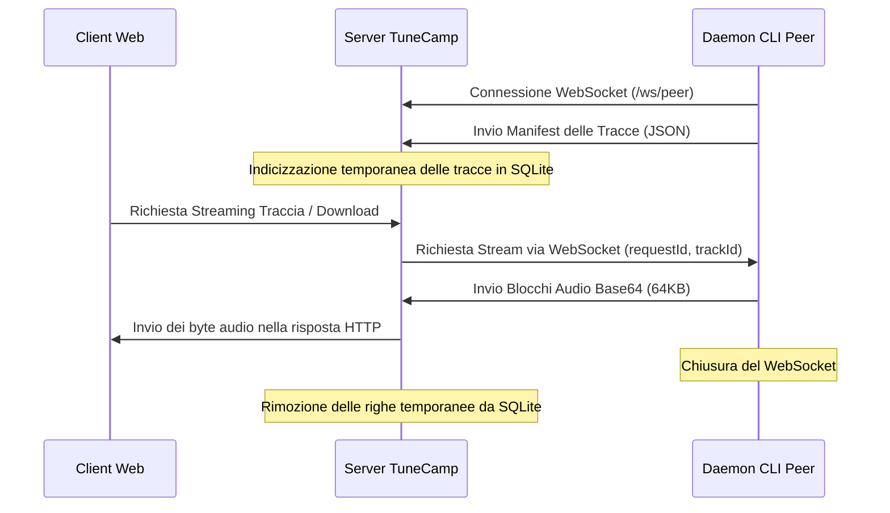

# Condivisione Peer-to-Peer (Peer Sharing)

TuneCamp Peer Sharing è una funzionalità integrata, ispirata al modello P2P, che consente agli utenti abilitati di condividere le proprie cartelle musicali locali con un'istanza TuneCamp in tempo reale. I brani condivisi sono temporanei e vengono serviti su richiesta tramite un tunnel WebSocket inverso, superando sistemi NAT e firewall senza richiedere il port-forwarding manuale o la configurazione del router.

---

## Panoramica dell'Architettura



1. **Connessione WebSocket di Controllo**: Il daemon del peer si connette a `/ws/peer` utilizzando un token di autenticazione JWT.
2. **Catalogazione Temporanea**: Il daemon scansiona le cartelle condivise e invia un manifest con i metadati. Il server indicizza queste tracce nel database SQLite.
3. **Tunneling su Richiesta (On-Demand)**: Quando un ascoltatore riproduce una traccia condivisa, il server la richiede al daemon tramite la connessione WebSocket. Il daemon legge il file in blocchi da 64KB, li codifica in base64 e li invia al server. Il server decodifica i blocchi e li convoglia direttamente nella risposta HTTP di Express.
4. **Rimozione Immediata**: Se il daemon viene arrestato o si disconnette, il ping di controllo (inviato ogni 30 secondi) fallisce o l'evento di disconnessione avvia la procedura di pulizia, eliminando immediatamente le tracce del peer e la sua sessione dal database.

---

## Configurazione per Amministratori

Gli amministratori possono controllare la condivisione peer tramite il **Pannello di Amministrazione**:

1. **Controlli Globali** (nella sezione **Settings → Customize Modules**):
   - **Enable Peer Sharing**: Abilita o disabilita la funzionalità a livello globale.
   - **Allow Peer Downloads**: Consente agli ascoltatori di scaricare i brani condivisi (se disabilitato, è consentito solo lo streaming).
2. **Permessi Utente** (nella sezione **Users**):
   - Abilita o disabilita la **Condivisione Peer** per i singoli utenti. Solo gli utenti con questo flag attivo possono stabilire una connessione WebSocket usando il daemon.
3. **Pannello delle Sessioni Attive** (nella sezione **Peer Sessions**):
   - Elenco in tempo reale di tutti i daemon connessi, con indicazione dell'account utente, ora di connessione, ultimo segnale di attività (heartbeat), indirizzo IP e numero totale di tracce condivise.
   - Consente agli amministratori di disconnettere o espellere (kick) manualmente qualsiasi sessione del daemon attiva.

### Importare una Traccia Peer nella Libreria

Oltre allo streaming e al download occasionale, i **Root Admin e i Manager** possono **importare** in modo permanente una traccia peer condivisa nella libreria locale. Il pulsante di importazione (accanto al download su ogni traccia peer) scarica il file completo attraverso il tunnel, lo salva in `<musicDir>/peer-imports/` e lo passa allo scanner affinché diventi una normale release locale, che sopravvive anche dopo la disconnessione del peer.

L'importazione richiede che i download siano consentiti (a livello globale, per la sessione e per la traccia), poiché trasferisce il file completo. L'azione è esposta su `POST /api/peers/:sessionId/tracks/:trackId/import` ed è riservata ai ruoli Root Admin / Manager.

---

## Esecuzione del Daemon CLI

Il client per la condivisione peer è un **pacchetto autonomo** ospitato in un repository separato: [`tunecamp-peer`](https://github.com/scobru/tunecamp-peer).

### Installazione

```bash
git clone https://github.com/scobru/tunecamp-peer.git
cd tunecamp-peer
npm install
```

### Prerequisiti

- Node.js (v18 o superiore)
- Un account TuneCamp con i permessi di condivisione peer abilitati dall'amministratore dell'istanza

### Configurazione

**Opzione A — file `.env` (consigliata)**:

```ini
TUNECAMP_SERVER=https://tuo-dominio-tunecamp.com
TUNECAMP_TOKEN=IL_TUO_TOKEN_JWT_O_TOKEN_SVILUPPATORE
TUNECAMP_SHARE=/percorso/della/mia/musica,/altro/percorso
TUNECAMP_ALLOW_DOWNLOADS=true
```

**Opzione B — argomenti da riga di comando**:

```bash
node peer-daemon.js --server <url> --token <token> --share <cartella1> <cartella2>
```

### Utilizzo

```bash
# Scansiona e verifica i metadati senza connetterti al server
npm run scan

# Avvia la condivisione
npm start
```

### Opzioni da Riga di Comando

- `-s, --server <url>`: URL dell'istanza TuneCamp di destinazione (di default `http://localhost:1970`).
- `-t, --token <jwt>`: Il tuo token sviluppatore o il JWT di sessione.
- `-f, --folder, --share <percorsi...>`: Una o più cartelle locali da scansionare e condividere.
- `--no-allow-downloads`: Limita la condivisione al solo streaming (disabilita il download).
- `--scan-only`: Scansiona ed elenca i metadati delle tracce locali, quindi esce.
- `-h, --help`: Mostra la guida all'uso.
