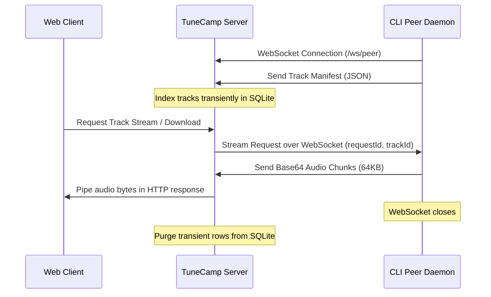

# TuneCamp Peer Sharing

TuneCamp Peer Sharing is a built-in, P2P-inspired capability allowing users with designated permissions to share their local music folders with a TuneCamp instance in real-time. Shared tracks are transient and served on-demand via a reverse WebSocket tunnel, bypassing NATs and firewalls without requiring manual port-forwarding or router configurations.

---

## Architecture Overview



1. **Control WebSocket Connection**: The peer daemon connects to `/ws/peer` using a JWT authentication token.
2. **Transient Cataloging**: The daemon scans the shared folders and uploads a metadata manifest. The server indexes these tracks in SQLite.
3. **On-Demand Tunneling**: When a listener plays a peer track, the server requests the track from the daemon over WebSocket. The daemon reads the file in 64KB chunks, encodes them in base64, and pushes them back. The server decodes the chunks and pipes them directly to the Express HTTP response stream.
4. **Instant Cleanup**: If the daemon shuts down or disconnects, the heartbeat ping (every 30 seconds) fails or the connection event triggers cleanup, immediately removing the peer's tracks and session from the database.

---

## Admin Configuration

Administrators can control peer sharing via the **Admin Panel**:

1. **Global Toggles** (under **Settings → Customize Modules**):
   - **Enable Peer Sharing**: Turns the feature on or off globally.
   - **Allow Peer Downloads**: Allows listeners to download shared tracks (when disabled, only streaming is permitted).
2. **User Permissions** (under **Users**):
   - Toggle **Peer Sharing** for individual users. Only users with this flag enabled can establish a WebSocket connection using the daemon.
3. **Active Dashboard** (under **Peer Sessions**):
   - Real-time list of all connected daemons, showing the user account, connection time, last heartbeat, IP address, and total shared tracks.
   - Allows administrators to manually disconnect/kick any active daemon session.

### Importing a Peer Track into the Library

Beyond streaming and one-off downloads, **Root Admins and Managers** can permanently **import** a shared peer track into the local library. The import button (next to download on each peer track) pulls the full file over the tunnel, writes it under `<musicDir>/peer-imports/`, and runs it through the scanner so it becomes a regular local release — surviving after the peer disconnects.

Importing requires downloads to be allowed (globally, for the session, and for the track), since it transfers the full file. The action is exposed at `POST /api/peers/:sessionId/tracks/:trackId/import` and is restricted to Root Admin / Manager roles.

---

## Running the CLI Daemon

The peer sharing client is a **standalone package** in its own repository: [`tunecamp-peer`](https://github.com/scobru/tunecamp-peer).

### Installation

```bash
git clone https://github.com/scobru/tunecamp-peer.git
cd tunecamp-peer
npm install
```

### Prerequisites

- Node.js (v18+)
- A TuneCamp account with peer-sharing permissions enabled by the administrator

### Configuration

**Option A — `.env` file (recommended)**:

```ini
TUNECAMP_SERVER=https://your-tunecamp-domain.com
TUNECAMP_TOKEN=YOUR_JWT_OR_DEVELOPER_TOKEN
TUNECAMP_SHARE=/path/to/my/music,/another/path
TUNECAMP_ALLOW_DOWNLOADS=true
```

**Option B — command-line arguments**:

```bash
node peer-daemon.js --server <url> --token <token> --share <folder1> <folder2>
```

### Usage

```bash
# Scan and verify metadata without connecting
npm run scan

# Start sharing
npm start
```

### Command Line Options

- `-s, --server <url>`: URL of the target TuneCamp instance (defaults to `http://localhost:1970`).
- `-t, --token <jwt>`: Your developer token or session JWT.
- `-f, --folder, --share <paths...>`: One or more directories to scan and share.
- `--no-allow-downloads`: Restrict to streaming only (disables downloads).
- `--scan-only`: Scan and list local track metadata, then exit.
- `-h, --help`: Display usage help.
