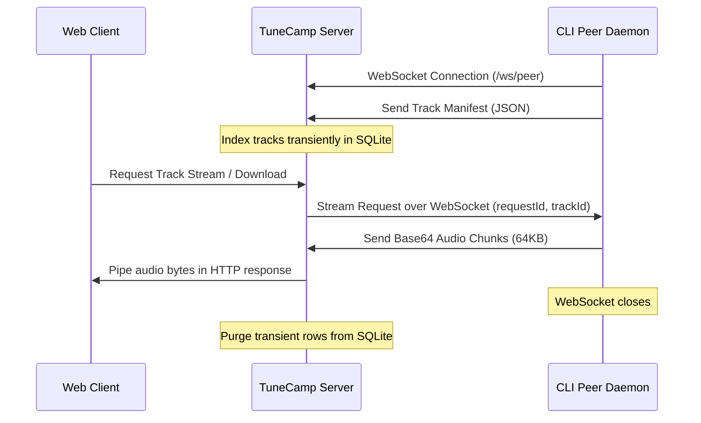

# TuneCamp Peer Sharing

TuneCamp Peer Sharing is a built-in, P2P-inspired capability allowing users with designated permissions to share their local music folders with a TuneCamp instance in real-time. Shared tracks are transient and served on-demand via a reverse WebSocket tunnel, bypassing NATs and firewalls without requiring manual port-forwarding or router configurations.

---

## Architecture Overview



1. **Control WebSocket Connection**: The peer daemon connects to `/ws/peer` using a JWT authentication token.
2. **Transient Cataloging**: The daemon scans the shared folders and uploads a metadata manifest. The server indexes these tracks in SQLite.
3. **On-Demand Tunneling**: When a listener plays a peer track, the server requests the track from the daemon over WebSocket. The daemon reads the file in 64KB chunks, encodes them in base64, and pushes them back. The server decodes the chunks and pipes them directly to the Express HTTP response stream.
4. **Instant Cleanup**: If the daemon shuts down or disconnects, the heartbeat ping (every 30 seconds) fails or the connection event triggers cleanup, immediately removing the peer's tracks and session from the database.

---

## Admin Configuration

Administrators can control peer sharing via the **Admin Panel**:

1. **Global Toggles** (under **Settings → Customize Modules**):
   - **Enable Peer Sharing**: Turns the feature on or off globally.
   - **Allow Peer Downloads**: Allows listeners to download shared tracks (when disabled, only streaming is permitted).
2. **User Permissions** (under **Users**):
   - Toggle **Peer Sharing** for individual users. Only users with this flag enabled can establish a WebSocket connection using the daemon.
3. **Active Dashboard** (under **Peer Sessions**):
   - Real-time list of all connected daemons, showing the user account, connection time, last heartbeat, IP address, and total shared tracks.
   - Allows administrators to manually disconnect/kick any active daemon session.

---

## Running the CLI Daemon

The peer sharing client is a standalone Node.js script located in `scripts/peer-daemon.mjs`.

### Prerequisites

- Node.js (v18+)
- Read access to your music directory

### Usage

1. **Obtain an API/JWT Token**:
   Log in to the web interface, open your developer settings, or copy the authentication token.
   
2. **Start the Connection**:
   Run the CLI daemon with the connection parameters and your shared folder paths:
   
   ```bash
   node scripts/peer-daemon.mjs connect \
     --server http://your-tunecamp-domain.com \
     --token YOUR_JWT_TOKEN \
     --share "/path/to/music/folder1" "/path/to/music/folder2"
   ```

### Command Line Options

- `--server <url>`: The URL of the TuneCamp server (defaults to `http://localhost:1970`).
- `--token <jwt>`: Your account authentication token.
- `--share <paths...>`: One or more local directory paths to scan and share.
- `--help`: Display usage help.
