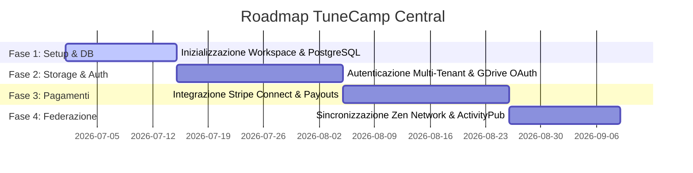

# TuneCamp Central - Piano Architetturale & Roadmap

Questo documento descrive la visione, l'architettura tecnica e la roadmap per la creazione di **TuneCamp Central**, una piattaforma SaaS centralizzata e federata concepita come applicazione completamente separata dal client/server self-hosted di TuneCamp.

---

## 1. Visione del Prodotto

TuneCamp Central si posiziona come il portale di riferimento per artisti, etichette e ascoltatori che desiderano utilizzare i servizi di TuneCamp senza la necessità di ospitare e gestire un'infrastruttura server propria (self-hosting). 

Al tempo stesso, non agisce come un ecosistema chiuso (silos): si integra con la rete decentralizzata esistente (nodi self-hosted) tramite i protocolli **Zen** (segnalazione e scoperta) e **ActivityPub** (social federation).

```
                     +---------------------------------------+
                     |         TuenCamp Central (SaaS)       |
                     |  - Multi-Tenant DB (PostgreSQL)       |
                     |  - Stripe Connect (Express)           |
                     |  - Storage Google Drive Multi-Utente  |
                     +-------------------+-------------------+
                                         |
                       [Zen / AP / HTTP REST Federation]
                                         |
                 +-----------------------+-----------------------+
                 |                                               |
     +-----------+-----------+                       +-----------+-----------+
     |  Istanza Self-Hosted  |                       |  Istanza Self-Hosted  |
     |        Artista A      |                       |        Artista B      |
     +-----------------------+                       +-----------------------+
```

---

## 2. Pilastri Tecnologici

### A. Architettura Multi-Tenant & Database (PostgreSQL)
Mentre TuneCamp self-hosted utilizza SQLite (`better-sqlite3`) per facilità di deployment, TuneCamp Central richiede un database relazionale robusto come **PostgreSQL** per gestire accessi concorrenti ad alta intensità e isolare i dati dei diversi tenant (artisti/utenti).

*   **Isolamento Logico**: Tutte le tabelle principali (`albums`, `tracks`, `playlists`, `purchases`) avranno relazioni esplicite con l'ID del tenant/artista (`artist_id` / `owner_id`).
*   **Gestione Ruoli (RBAC)**:
    *   **Super Admin**: Gestisce la piattaforma, commissioni, dispute e moderazione.
    *   **Artista**: Gestisce la propria pagina, carica musica, collega lo storage ed il conto Stripe.
    *   **Ascoltatore**: Profilo utente per acquistare, creare playlist e ascoltare brani.

### B. Stripe Connect (Express) per i Pagamenti
Per consentire flussi di pagamento diretti ed automatizzati tra acquirenti ed artisti senza che TuneCamp debba assumersi la responsabilità della custodia dei fondi:

1.  **Onboarding Artista**: Gli artisti collegano un account **Stripe Express** tramite la piattaforma. Stripe gestisce la conformità fiscale, l'identità (KYC) e i payout bancari.
2.  **Split delle Transazioni**: Durante l'acquisto di un album o di una singola traccia, la piattaforma calcola la commissione ed esegue un pagamento split:
    *   Quota Artista: Inviata direttamente sul conto Stripe Connect dell'artista.
    *   Quota Piattaforma (es. 10%): Trattenuta come profitto per coprire i costi operativi.
3.  **Webhook Unificato**: Un webhook Stripe centralizzato riceve gli eventi `payment_intent.succeeded` per generare i codici di sblocco dell'acquisto e notificare il database.

### C. Google Drive Storage Multi-Utente
Ospitare file audio lossless (WAV, FLAC) su server proprietari comporterebbe costi insostenibili di storage e traffico dati in uscita (egress). TuneCamp Central delega lo storage agli artisti:

*   **OAuth Delega**: Ogni artista autorizza TuneCamp ad accedere a una cartella specifica del proprio Google Drive personale.
*   **Streaming Proxy**: Il server backend di Central intercetta la richiesta di riproduzione, recupera i token OAuth dell'artista proprietario del brano, apre uno stream di lettura da Google Drive (`alt=media`) e lo trasmette al browser del visitatore.
*   **Range Requests**: Supporto nativo per le richieste di intervallo HTTP per consentire agli utenti di spostarsi avanti e indietro nella timeline del brano senza interruzioni.
*   **CDN Caching**: Caching temporaneo dei brani più ascoltati del momento per evitare il superamento dei limiti di quota API di Google Drive.

### D. Hub di Federazione ed Interoperabilità
Central non si isola, ma funge da portale d'ingresso per la rete federata di TuneCamp:

*   **Global Search (Zen Indexer)**: Un servizio in background scansiona periodicamente i nodi registrati sulla rete di segnalazione Zen e ne indicizza i cataloghi pubblici (`/api/catalog`), consentendo la ricerca e l'ascolto di brani auto-ospitati direttamente dal sito centralizzato.
*   **ActivityPub Bridge**: Gli artisti registrati su Central dispongono di un profilo federato (es. `@nomeartista@tunecamp.com`) in grado di comunicare con altre istanze TuneCamp self-hosted e con piattaforme del Fediverso (Mastodon, Funkwhale).

---

## 3. Scelte Tecnologiche & Domande Aperte

Prima di avviare lo sviluppo, è necessario chiarire i seguenti punti strategici:

### 1. Condivisione del Codice (Monorepo vs Repo Separata)
*   **Opzione A (Monorepo - Consigliata)**: Integrare TuneCamp Central come nuovo workspace all'interno dell'attuale repository TuneCamp (usando npm workspaces). Permette di condividere moduli logici essenziali (decodifica metadati FFmpeg, logiche di federation ActivityPub, query SQL comuni) riducendo la duplicazione del codice.
*   **Opzione B (Repo Autonoma)**: Creare un repository Git completamente separato. Offre un isolamento totale del codice ma richiede la duplicazione o la pubblicazione di pacchetti npm privati per riutilizzare la logica di base.

### 2. Framework Frontend
*   **Opzione A (React + Vite)**: Mantenere lo stesso stack della `webapp` self-hosted. Semplice da sviluppare, ma limita l'ottimizzazione SEO per le pagine pubbliche degli artisti (essendo una Single Page Application renderizzata solo lato client).
*   **Opzione B (Next.js - Consigliata)**: Utilizzare Next.js per il frontend di Central. Consente il Server-Side Rendering (SSR) per le pagine degli artisti, garantendo tempi di caricamento rapidi e un'ottimizzazione SEO ideale (fondamentale per permettere agli artisti di posizionarsi su Google).

---

## 4. Fasi della Roadmap Proposta



### Fase 1: Setup dell'Infrastruttura & Database
*   Inizializzazione del nuovo modulo o repository per TuneCamp Central.
*   Creazione dello schema di database PostgreSQL per supportare la multi-tenancy.
*   Setup dell'autenticazione centralizzata e dei profili utente differenziati (Artista / Ascoltatore).

### Fase 2: Integrazione Storage Google Drive Multi-Utente
*   Sviluppo del flusso OAuth2 specifico per gli artisti per connettere il proprio account Drive.
*   Implementazione del servizio di streaming audio basato su token specifici dell'artista con supporto alle range requests.
*   Interfaccia di caricamento ed indicizzazione file musicali da Google Drive.

### Fase 3: Integrazione Stripe Connect & Split dei Pagamenti
*   Implementazione del flusso di onboarding Stripe Connect Express per gli artisti.
*   Creazione delle API per avviare sessioni di acquisto con calcolo dinamico delle commissioni (split payments).
*   Gestione dei webhook Stripe Connect per sbloccare l'accesso ed il download dei brani acquistati.

### Fase 4: Federazione, Ricerca Globale & UI Launch
*   Integrazione del crawler Zen per indicizzare i cataloghi delle istanze self-hosted.
*   Sviluppo del portale pubblico con ricerca globale e pagine degli artisti indicizzabili sui motori di ricerca.
*   Attivazione dei profili ActivityPub per interagire con il Fediverse.
