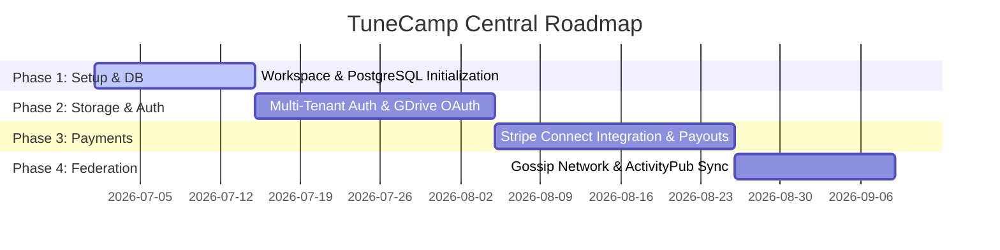

# TuneCamp Central - Architectural Plan & Roadmap

This document describes the vision, technical architecture, and roadmap for the creation of **TuneCamp Central**, a centralized and federated SaaS platform conceived as a completely separate application from the self-hosted TuneCamp client/server.

---

## 1. Product Vision

TuneCamp Central positions itself as the go-to portal for artists, labels, and listeners who wish to use TuneCamp services without the need to host and manage their own server infrastructure (self-hosting).

At the same time, it does not act as a closed ecosystem (silo): it integrates with the existing decentralized network (self-hosted nodes) via HTTP gossip discovery and the **ActivityPub** protocol (social federation).

```
                     +---------------------------------------+
                     |         TuneCamp Central (SaaS)       |
                     |  - Multi-Tenant DB (PostgreSQL)       |
                     |  - Stripe Connect (Express)           |
                     |  - Multi-User Google Drive Storage    |
                     +-------------------+-------------------+
                                         |
                       [Gossip / AP / HTTP REST Federation]
                                         |
                  +-----------------------+-----------------------+
                  |                                               |
      +-----------+-----------+                       +-----------+-----------+
      |  Self-Hosted Instance  |                       |  Self-Hosted Instance  |
      |        Artist A      |                       |        Artist B      |
      +-----------------------+                       +-----------------------+
```

---

## 2. Technological Pillars

### A. Multi-Tenant Architecture & Database (PostgreSQL)
While self-hosted TuneCamp uses SQLite (`better-sqlite3`) for ease of deployment, TuneCamp Central requires a robust relational database like **PostgreSQL** to handle high-intensity concurrent accesses and isolate data from different tenants (artists/users).

*   **Logical Isolation**: All main tables (`albums`, `tracks`, `playlists`, `purchases`) will have explicit relationships with the tenant/artist ID (`artist_id` / `owner_id`).
*   **Role Management (RBAC)**:
    *   **Super Admin**: Manages the platform, fees, disputes, and moderation.
    *   **Artist**: Manages their page, uploads music, connects storage, and links their Stripe account.
    *   **Listener**: User profile to purchase, create playlists, and listen to tracks.

### B. Stripe Connect (Express) for Payments
To enable direct and automated payment flows between buyers and artists without TuneCamp having to take responsibility for funds custody:

1.  **Artist Onboarding**: Artists connect a **Stripe Express** account through the platform. Stripe handles tax compliance, identity verification (KYC), and bank payouts.
2.  **Transaction Splitting**: During the purchase of an album or a single track, the platform calculates the commission and executes a split payment:
    *   Artist Share: Sent directly to the artist's Stripe Connect account.
    *   Platform Share (e.g., 10%): Retained as profit to cover operating costs.
3.  **Unified Webhook**: A centralized Stripe webhook receives `payment_intent.succeeded` events to generate purchase unlock codes and update the database.

### C. Multi-User Google Drive Storage
Hosting lossless audio files (WAV, FLAC) on proprietary servers would lead to unsustainable storage and outbound data traffic (egress) costs. TuneCamp Central delegates storage to the artists:

*   **OAuth Delegation**: Each artist authorizes TuneCamp to access a specific folder on their personal Google Drive.
*   **Streaming Proxy**: The Central backend server intercepts the playback request, retrieves the OAuth tokens of the artist owning the track, opens a read stream from Google Drive (`alt=media`), and transmits it to the visitor's browser.
*   **Range Requests**: Native support for HTTP range requests to allow users to scrub forward and backward in the track timeline without interruption.
*   **CDN Caching**: Temporary caching of the most listened to tracks to avoid exceeding Google Drive API quota limits.

### D. Federation and Interoperability Hub
Central does not isolate itself, but acts as a gateway to the federated TuneCamp network:

*   **Global Search (Gossip Indexer)**: A background service periodically scans the registered nodes on the federated discovery network and indexes their public catalogs (`/api/catalog`), enabling search and listening of self-hosted tracks directly from the centralized site.
*   **ActivityPub Bridge**: Artists registered on Central have a federated profile (e.g., `@artistname@tunecamp.com`) capable of communicating with other self-hosted TuneCamp instances and Fediverse platforms (Mastodon, Funkwhale).

---

## 3. Tech Choices & Open Questions

Before starting development, the following strategic points must be clarified:

### 1. Code Sharing (Monorepo vs Separate Repo)
*   **Option A (Monorepo - Recommended)**: Integrate TuneCamp Central as a new workspace within the current TuneCamp repository (using npm workspaces). It allows sharing essential logic modules (FFmpeg metadata decoding, ActivityPub federation logic, common SQL queries) reducing code duplication.
*   **Option B (Autonomous Repo)**: Create a completely separate Git repository. Offers total code isolation but requires duplication or publication of private npm packages to reuse basic logic.

### 2. Frontend Framework
*   **Option A (React + Vite)**: Maintain the same stack as the self-hosted `webapp`. Simple to develop, but limits SEO optimization for public artist pages (being a Single Page Application rendered only client-side).
*   **Option B (Next.js - Recommended)**: Use Next.js for Central's frontend. Enables Server-Side Rendering (SSR) for artist pages, ensuring fast load times and ideal SEO optimization (essential for allowing artists to rank on Google).

---

## 4. Proposed Roadmap Phases



### Phase 1: Infrastructure Setup & Database
*   Initialization of the new module or repository for TuneCamp Central.
*   Creation of the PostgreSQL database schema to support multi-tenancy.
*   Setup of centralized authentication and differentiated user profiles (Artist / Listener).

### Phase 2: Multi-User Google Drive Storage Integration
*   Development of the artist-specific OAuth2 flow to connect their Drive account.
*   Implementation of the audio streaming service based on artist-specific tokens with support for range requests.
*   Interface for uploading and indexing music files from Google Drive.

### Phase 3: Stripe Connect Integration & Payment Splitting
*   Implementation of the Stripe Connect Express onboarding flow for artists.
*   Creation of APIs to initiate purchase sessions with dynamic fee calculation (split payments).
*   Handling of Stripe Connect webhooks to unlock access and download of purchased tracks.

### Phase 4: Federation, Global Search & UI Launch
*   Integration of the Gossip crawler to index self-hosted instance catalogs.
*   Development of the public portal with global search and search-engine indexable artist pages.
*   Activation of ActivityPub profiles to interact with the Fediverse.
